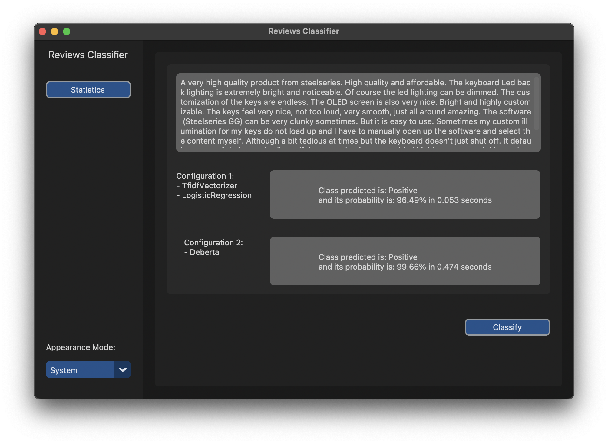

# Amazon Reviews Classifier
Amazon Reviews Classifier is a python application that exploit text mining to categorize product reviews to positive or negative class.

## Text Classification
In this project are used two different approach to classify, the first is the traditional and the other one is using pre-trained NLI models as a ready-made zero-shot sequence classifiers.

### Traditional Classifiers
The process to classify the text has composed by three steps:
1. Preprocess
   * Text preprocess is a very important phase, that include:
     * Expanding contraction (only for english language)
     * Removal of stopwords, punctuation, html tags, urls, diacritics, digits and extra whitespaces
     * Stemming
     * Lemmatization
2. <a href="https://scikit-learn.org/stable/modules/generated/sklearn.feature_extraction.text.TfidfVectorizer.html">TfidfVectorizer</a>
3. Classifiers:
   - <a href="https://scikit-learn.org/stable/modules/generated/sklearn.linear_model.LogisticRegression.html">LogisticRegression</a>
   * To find the best parameters of classifiers is used <a href="https://scikit-learn.org/stable/modules/generated/sklearn.model_selection.GridSearchCV.html">GridSearchCV</a>
   * Model of classifiers are saved in [models_saved folder](models_saved), so every time that application restarts doesn't refit models but 
   loads them from the folder. Otherwise, application fits and save models when the dataset changes. 

### Pre-trained Classifiers
Two different NLI models, in particular they are:
* <a href="https://huggingface.co/facebook/bart-large-mnli">facebook/bart-large-mnli</a>
* <a href="https://huggingface.co/MoritzLaurer/DeBERTa-v3-base-mnli-fever-anli">MoritzLaurer/DeBERTa-v3-base-mnli-fever-anli</a>

## Data

The dataset used to train and test the correct behavior of the application:
- <a href="https://www.kaggle.com/datasets/kritanjalijain/amazon-reviews?select=train.csv">Amazon Reviews</a>

## Models Evaluations

* Accuracy:
  - MultinomialNB = 0.86
  - LogisticRegression = 0.89
  - Bart = 0.86
  - DeBERTa = 0.88

## Dependencies

News Classifier needs the following libraries:
- <a href="https://libraries.io/pypi/contractions/0.1.73">Contractions</a>
- <a href="https://libraries.io/pypi/customtkinter/5.0.3">Customtkinter</a>
- <a href="https://pypi.org/project/dill/">Dill</a>
- <a href="https://matplotlib.org">Matplotlib</a>
- <a href="https://www.nltk.org">NLTK</a>
- <a href="https://numpy.org/">NumPy</a>
- <a href="https://pandas.pydata.org/">Pandas</a>
- <a href="https://pypi.org/project/pycountry/">Pycountry</a>
- <a href="https://scikit-learn.org/stable/">SKLearn</a>
- <a href="https://seaborn.pydata.org">Seaborn</a>
- <a href="https://pypi.org/project/simplemma/">Simplemma</a>
- <a href="https://texthero.org">Texthero</a>
- <a href="https://huggingface.co/docs/transformers/installation">Transformers</a>
- <a href="https://www.scikit-yb.org/en/latest/">Yellowbrick</a>

[Here](requirements.txt) is present the file with all dependencies of the project.

To install all dependencies use:  `pip install -r requirements.txt`

## Usage

In [the src folder](src) of this repo, there is code of the application to run locally on your own computer.
In your terminal while in this repo directory, run the following commands to use application:

>`cd src` 
> 
> `python main.py`

or
> `python src/main.py`

In [the file main](/src/main.py) is possible to set which classifiers you want use.

This application has these following buttons:
* Classify
  * Calculates predicted class and its probability of the news written in textbox for each classifier.
* Statistics
  * Displays statistics on:
    * Dataset:
      * Class Distribution
      * Wordcloud of training and test set
      * Most frequent words on training and test set
      * General Information on dataset
    * Classifiers (for each one):
      * Classification Report
      * Confusion Matrix

The image below is the home of application:

